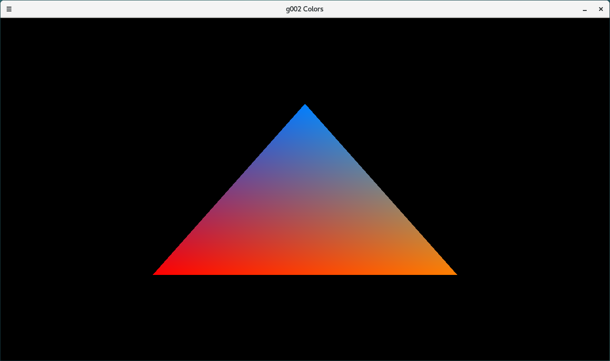

# Go Oberon OpenGL

Go and [Oberon](https://freeoberon.su/en) examples of OpenGL 3D graphics.

Примеры программ, реализующих 3D-графику с помощью OpenGL на языках Go и [Oberon](https://freeoberon.su).

## How To Use
1. Install Go, OpenGL and SDL2.
```
go get -u github.com/go-gl/gl/v3.3-core/gl
go get -u github.com/veandco/go-sdl2/sdl
```

2. Clone this repository:
```
git clone git@github.com:kekcleader/goAndOberonOpenGL.git
```
or download it.

3. Go to subdirectory `g001_simplest` and type:
```
make
```
to compile and run the program.

## Source Files

| File Name | Description |
| --------- | ----------- |
| [g001\_simplest](g001_simplest) | Simplest Go example of 3D graphics using OpenGL + SDL2. Draws a triangle on the screen. |
| [g002\_colors](g002_colors) | Applies a gradient color to the triangle. |
| [g003\_texture](g003_texture) | Applies a simple texture to the triangle. |


